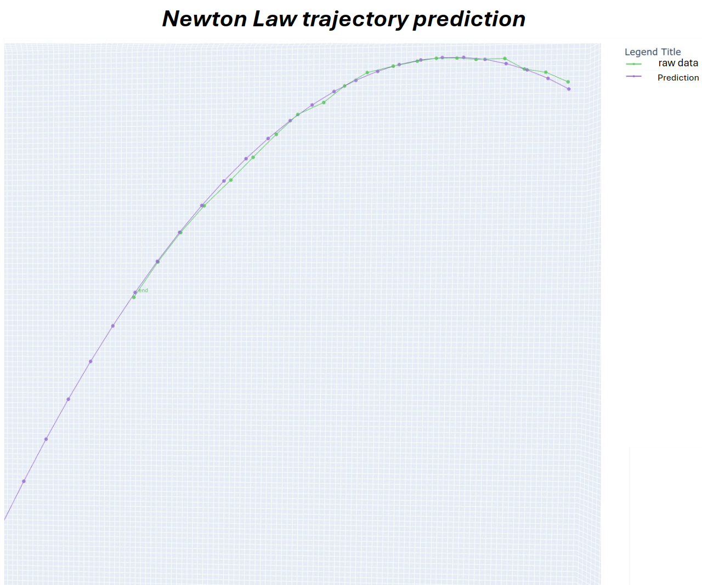

# Newton_law_trajectory_prediction
This repository applies Newton’s second law and least-squares optimization to predict the trajectory of a flying object.
- Use RANSAC algorithm to filter noise​
- Use least square optimization to find v0, p0​

